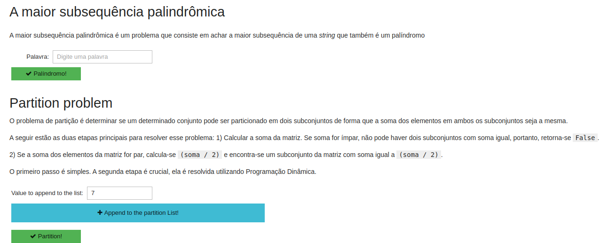
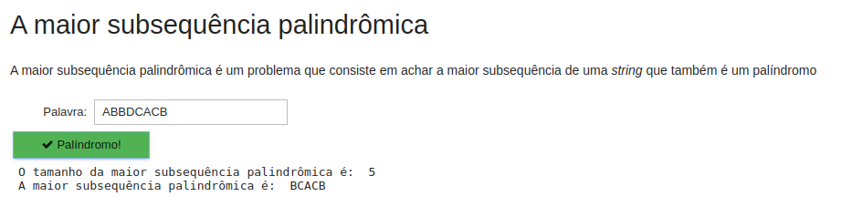
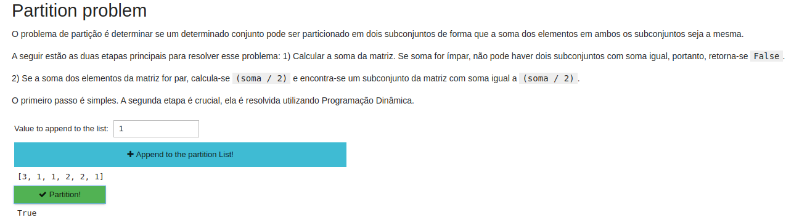

# Two4one

**Número da Lista**: 5<br>
**Conteúdo da Disciplina**: Programação Dinâmica<br>

## Alunos
|Matrícula | Aluno |
| -- | -- |
| 17/0138798  |  Caio Fernandes |
| 17/0050939 | Lucas Dutra |

## Sobre 
### A maior subsequência palindrômica
A maior subsequência palindrômica é um problema que consiste em achar a maior subsequência de uma _string_ que também é um palíndromo. Digite uma palavra no campo e aperte o botão "Palíndromo!", que será mostrado o tamanho da maior subsequência palindrômica e a maior subsequência palindrômica.
### Partition problem
O problema de partição é determinar se um determinado conjunto pode ser particionado em dois subconjuntos de forma que a soma dos elementos em ambos os subconjuntos seja a mesma.

A seguir estão as duas etapas principais para resolver esse problema:
1) Calcular a soma da matriz. Se soma for ímpar, não pode haver dois subconjuntos com soma igual, portanto, retorna-se `False`.<br>

2) Se a soma dos elementos da matriz for par, calcula-se  `(soma / 2)` e encontra-se um subconjunto da matriz com soma igual a `(soma / 2)`.

O primeiro passo é simples.
A segunda etapa é crucial, ela é resolvida utilizando Programação Dinâmica.

## Screenshots
### App completo

### Palíndromo

### Partition


## Instalação 
**Linguagem**: Python<br>

### Requisitos para executar o projeto
1. [Docker](https://docs.docker.com/get-docker/)
2. [Docker-Compose](https://docs.docker.com/compose/install/)

### Executando o projeto
1. Executar o docker-compose (pode necessitar de permissões de administrador)
    ```
        docker-compose up --build
    ```
2. Acesse, por meio de um navegador o seguinte link
    ```
        http://localhost:8888/
    ```

## Uso 
### Palíndromo
1. Insira uma palavra no campo indicado.
2. Clique no botão "Palíndromo" para obter a maior subsequência palindrômica e o tamanho da maior subsequência palindrômica.
### Partition
1. Insira números aleatórios no campo indicado.
2. Clique no botão "Append to the partition List!" para adicionar o número escolhido na lista.
3. Após inserido todos os números desejados, clique no botão "Partition!".
4. O resultado será um booleano se é possível ou não um conjunto pode ser particionado em dois subconjuntos de forma que a soma dos elementos em ambos os subconjuntos seja a mesma.


